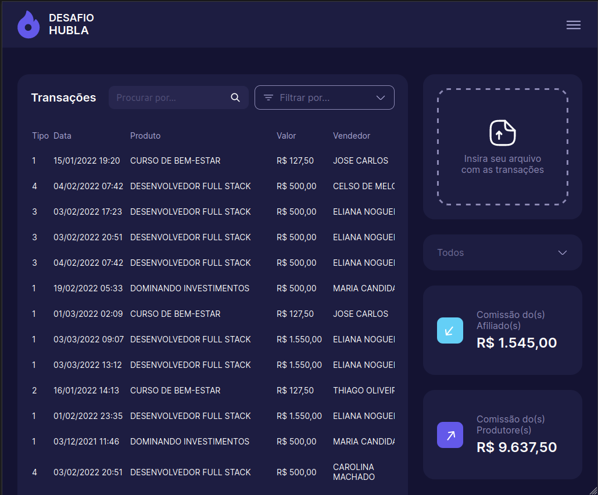

# Desafio Hubla

This is dash board where users can analyse a list of transactions.

<table>
<tr>
<td>


</td>

<td>


</td>

<td>



</td>
</tr>
</table>

<center>


</center>

[Figma Layout](https://www.figma.com/file/i0diXnZ5d6FSCKiQjgdtzf/Untitled?type=design&t=7kmLfKgWKRn914ii-1)

[Layout Reference](https://www.figma.com/file/ojNagH7l12m5HS62ChmFw7/Dashboard-Finance-Bank-Fintech-(Community)?type=design&t=7kmLfKgWKRn914ii-1)

Techs used:
- [Next.js](https://nextjs.org/)
- [Reactjs - Context api for state management](https://react.dev/reference/react/useContext)
- [Styled-components for styling](https://styled-components.com/)
- [Prisma as ORM](https://www.prisma.io/)
- [SQLite as the database](https://sqlite.org/index.html)
- [Next.js - Api Routes for API](https://nextjs.org/docs/pages/building-your-application/routing/api-routes)
- [Iron-Session for authorization](https://github.com/vvo/iron-session)

## Running locally
So you can run this project locally in your machine you have two options:

#### Standard
clone the project, then:

```bash
cd desafio-programacao-fullstack-1.2.0

npm i

npm run dev
```
or, if you prefer Yarn:
```bash
yarn

yarn dev
```
#### Docker
clone the project, then:

```bash
cd desafio-programacao-fullstack-1.2.0

docker compose up # if you are using docker compose plugin
# or
docker-compose up # if you are using standalone docker compose
```


After that all you need is to open your web browser and run: [http://localhost:3000](http://localhost:3000) and thats it.

<center>


</center>

## Insomnia Collection

If you wish to run API requests by insomnia download this [File (insomnia-docs.json)](./insomnia-docs.json) and import it to your insomnia.

<table>
<tr>
<td>


</td>

<td>


</td>
</tr>
</table>